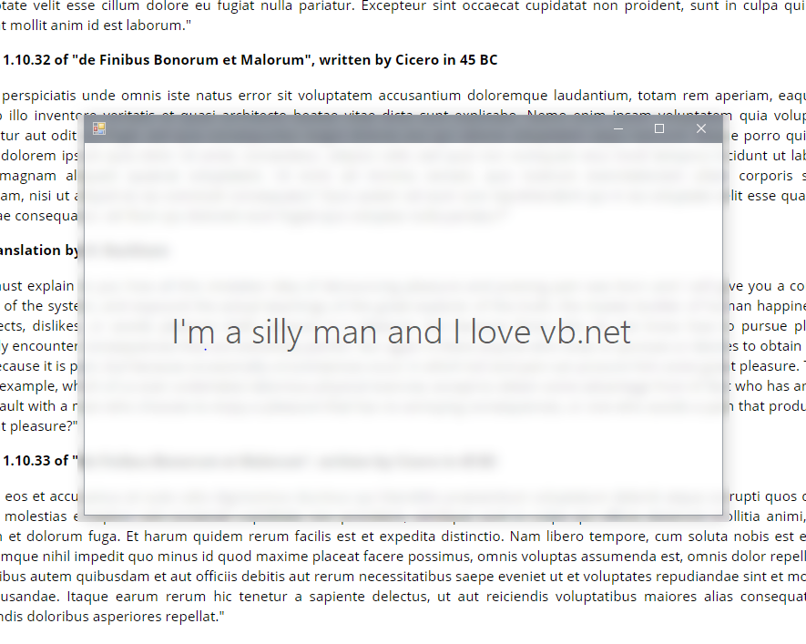

# WinFormBlur

A simple vb.net winform app with blurred background effect

vb.net과 윈폼으로 만든 간단한 배경 흐림 효과를 가진 앱

Reference Project: https://github.com/riverar/sample-win10-aeroglass

## Known Issues
- Always have to place ``BlurForm`` bottom of your ``MainForm`` in order to see blurry background.
- ``BlurForm`` may not perfectly fit with ``MainForm`` unless you set ``FormBoaderStyle`` to ``None``.
- This thing is obviously not a good solution.

## 알려진 문제들
- 흐린 배경을 보기 위해 ``BlurForm`` 을 ``MainForm`` 아래에 항상 두어야 합니다.
- ``FormBoaderStyle`` 을 ``None`` 으로 설정하지 않는 한 ``BlurForm``이 ``MainForm``과 완벽하게 맞지 않을 수 있습니다.
- 보다시피 이게 썩 좋은 수단은 아닙니다.
